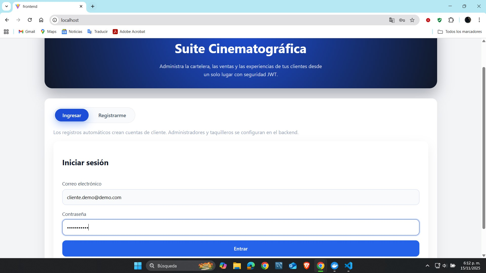
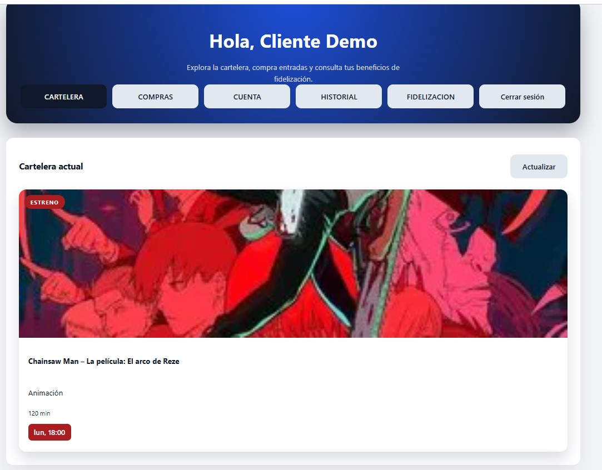
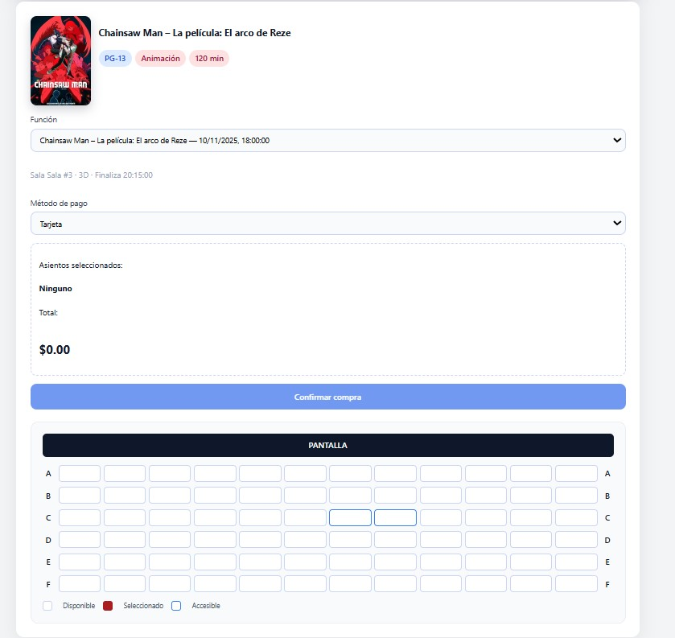
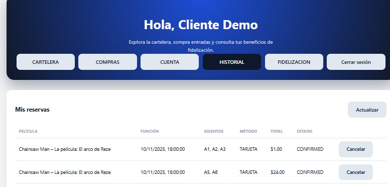
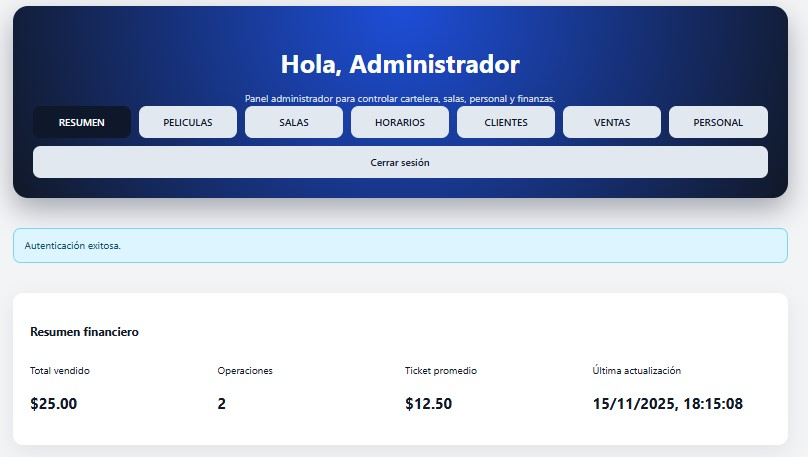
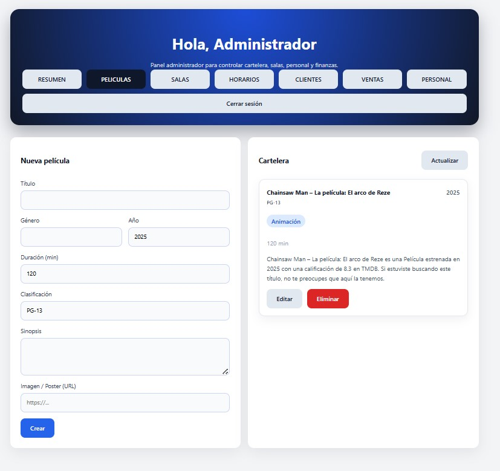
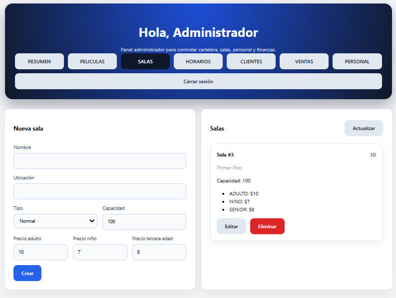

##  Autores
- Brayan Yecid Aparicio Goyeneche
- Neider Alirio Piza Basto 
- Leider Joanny Esteban Lozano 

# Solución FullStack – Actividad Entornos

Suite integral para la operación de un cine: autenticación segura vía JWT con roles (administrador, taquillero y cliente), gestión de cartelera/salas/horarios, control de ventas y personal, además de un panel de cliente para compras, historial, fidelización y notificaciones. Backend en Spring Boot + MongoDB, frontend en React (Vite).

## Estructura

- `backend/`: API REST con seguridad, validaciones y lógica de negocio (películas, salas, horarios, ventas, reportes, fidelización).
- `frontend/`: SPA React con paneles diferenciados para staff y clientes.

## Requisitos

- Java 21 (LTS) and Maven Wrapper (`backend/mvnw`).
- Node.js 20.19+ (Vite muestra un warning si usas una versión menor) y npm.
- MongoDB (local o Atlas).
- Docker desktop

## Variables de entorno principales

| Variable | Descripción | Predeterminado |
| --- | --- | --- |
| `MONGODB_URI` | Cadena de conexión MongoDB | `mongodb://localhost:27017/actividad_entornos` |
| `JWT_SECRET` | Clave HMAC (mínimo 32 caracteres) | `change-this-secret-key-and-keep-it-long` |
| `JWT_EXPIRATION_MS` | Duración del token | `3600000` |
| `CORS_ALLOWED_ORIGINS` | Orígenes permitidos | `http://localhost:5173` |
| `ADMIN_EMAIL`, `ADMIN_PASSWORD`, `ADMIN_NAME` | Admin inicial | `admin@demo.com`, `ChangeMe123!`, `Administrador` |
| `VITE_API_URL` | URL del backend para la SPA | `http://localhost:8080` |

Al iniciar la app se siembran automáticamente:
- Admin principal (valores configurables).
- administrador `admin@demo.com / ChangeMe123!)`
- Taquillero: `taquilla@demo.com / Taquilla123!`
- Cliente demo: `cliente.demo@demo.com / Cliente123!`

## Puesta en marcha con Docker Compose

```bash
docker compose up --build
```

- MongoDB → `mongodb://localhost:27017`
- Backend → `http://localhost:8080`
- Frontend (Nginx) → `http://localhost`

Detener servicios: `docker compose down`.  
Reconstruir tras cambios: `docker compose up --build`.

## Ejecución manual

Backend:
```bash
cd backend
./mvnw spring-boot:run
```

Frontend:
```bash
cd frontend
npm install
npm run dev
```
La SPA queda en `http://localhost:5173` (ajusta `VITE_API_URL` si el backend corre en otra ruta).

## Endpoints destacados

- `POST /api/auth/register` – solo clientes (rol `ROLE_CLIENT`).
- `POST /api/auth/login` – devuelve JWT, correo y rol.
- `GET/POST/PUT/DELETE /api/movies` – películas con sinopsis, duración, clasificación y poster (staff/admin).
- `GET/POST/PUT/DELETE /api/rooms` – salas, tipo (Normal, 3D, IMAX) y precios por público (admin).
- `GET/POST/PUT/DELETE /api/showtimes` – funciones; el backend calcula la hora de fin según la duración + preparación (staff/admin).
- `GET/POST/PUT/DELETE /api/clients` – gestión de clientes (staff/admin).
- `GET /api/bookings` (staff) / `GET /api/bookings/mine` (cliente) / `POST /api/bookings` – reservas con asientos, método de pago y acumulación de puntos.
- `GET /api/reports/dashboard` – resumen financiero (ventas por película, sala y método de pago).
- `GET/POST /api/staff` – alta de personal (solo admin).
- `GET/PATCH /api/account` – datos del usuario autenticado y preferencias de notificación.

## Paneles (frontend).

### Administrador/Taquillero
- **Resumen**: KPI de ventas, ticket promedio y métodos de pago.
- **Cartelera**: CRUD de películas.
- **Salas**: gestión de ubicaciones, tipos y precios.
- **Horarios**: programación automática con cálculo de hora fin.
- **Clientes**: edición/alta rápida por parte del staff.
- **Ventas**: listado y cancelación de reservas.
- **Personal** (solo admin): alta de administradores/taquilleros.

### Cliente
- **Cartelera**: consulta de películas disponibles.
- **Compras**: selección de función, asientos y método de pago.
- **Cuenta**: actualización de datos personales y preferencias de notificación.
- **Historial**: reservas pasadas/activas con opción de cancelar.
- **Fidelización**: puntos acumulados y beneficios.

## Pruebas y build

- Backend: `./mvnw verify`
- Frontend: `npm run build` (el build se genera aunque aparezca el warning de versión de Node).

## Imagenes del proyecto desplegado









